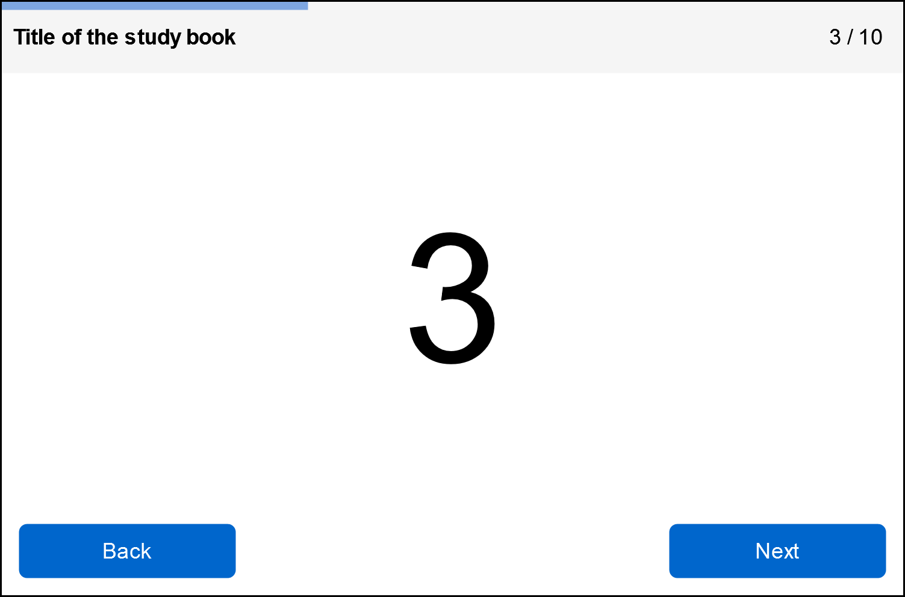
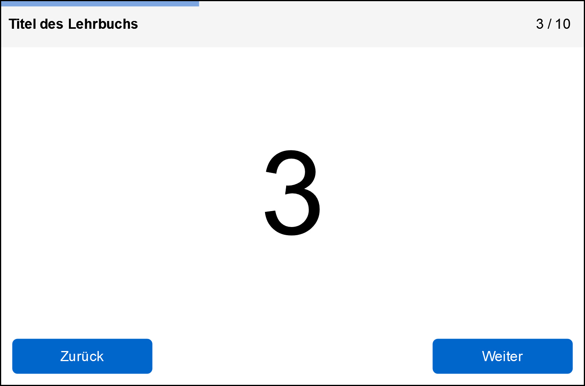

Lecture-Slides.js: Component Framework Benchmark
================================================

1. [Description](#description)
1. [Mockups](#mockups)
1. [Pre-selection](#pre-selection)
1. [Mock Implementation](#mock-implementation)
1. [Copyright](#copyright)

Description
-----------

This is a pre-study for the next version of [lecture-slides.js](https://github.com/DennisSchulmeister/lecture-slides.js).
The goal is to rewrite the frontend application with a more modern architecture
either using web components or one of the better known component frameworks like
Angular or React. For this the implications in terms of code complexity, bundle
size, maintainability etc. have to be understood. The research design is:

1. Identify suitable candidates of each category
2. Numerically rank the candidates within each category (see below)
3. Find the best candidate of each category according to the total score
4. Implement a medium-sized mockup with both chosen frameworks
5. Numerically evaluate the final results to find the ultimate winner (see more below)

Mockups
-------

The following images show a sketch of the demo application. Each implementation tries
to mimic this UI comparable features and code structure.

Pre-selection
-------------

The following table summarizes research steps one to three. It lists the chosen
candidates, the evaluated figures and score calculation. Base date for all values
is April 26 2024.

<small>
  <small>
    <table style="border: 1px solid black;">
      <thead>
        <tr>
          <th colspan="1" style="text-align: center; border-right: 1px solid black;">Framework</th>
          <th colspan="2" style="text-align: center; border-right: 1px solid black;">Age</th>
          <th colspan="2" style="text-align: center; border-right: 1px solid black;">Project Size</th>
          <th colspan="2" style="text-align: center; border-right: 1px solid black;">Development Activity</th>
          <th colspan="2" style="text-align: center; border-right: 1px solid black;">Release Activity</th>
          <th colspan="2" style="text-align: center; border-right: 1px solid black;">Contributors</th>
          <th colspan="3" style="text-align: center; border-right: 1px solid black;">Issues</td>
          <th colspan="3" style="text-align: center; border-right: 1px solid black;">Pull Requests</th>
        </tr>
        <tr>
          <th style="writing-mode: vertical-lr; border-right: 1px solid black;">Name</th>
          <th style="writing-mode: vertical-lr;">Started</th>
          <th style="writing-mode: vertical-lr; border-right: 1px solid black;"># Months</th>
          <th style="writing-mode: vertical-lr;"># Files</th>
          <th style="writing-mode: vertical-lr; border-right: 1px solid black;"># Lines of Code</th>
          <th style="writing-mode: vertical-lr;"># Commits</th>
          <th style="writing-mode: vertical-lr; border-right: 1px solid black;">per Month/LoC</th>
          <th style="writing-mode: vertical-lr;"># Versions</th>
          <th style="writing-mode: vertical-lr; border-right: 1px solid black;">per Month/LoC</th>
          <th style="writing-mode: vertical-lr;"># Contributors</th>
          <th style="writing-mode: vertical-lr; border-right: 1px solid black;">per LoC</th>
          <th style="writing-mode: vertical-lr;"># Open</th>
          <th style="writing-mode: vertical-lr;"># Closed</th>
          <th style="writing-mode: vertical-lr; border-right: 1px solid black;">% Closed</th>
          <th style="writing-mode: vertical-lr;"># Open</th>
          <th style="writing-mode: vertical-lr;"># Closed</th>
          <th style="writing-mode: vertical-lr; border-right: 1px solid black;">% Closed</th>
        </tr>
      </thead>
      <tbody>
        <tr>
          <td colspan="17" style="border: 1px solid black;">Web Component Frameworks</td>
        </tr>
        <tr>
          <td style="border-right: 1px solid black;"><a href="https://lit.dev/" target="_blank">Lit</a></td>
          <td>0&nbsp;/&nbsp;2017</td>
          <td style="border-right: 1px solid black;"><b>83</b></td>
          <td>427</td>
          <td style="border-right: 1px solid black;"><b>104,837</b></td>
          <td>2,469</td>
          <td style="border-right: 1px solid black;"><b>0.00028</b></td>
          <td>506</td>
          <td style="border-right: 1px solid black;"><b>0.000058</b></td>
          <td>176</td>
          <td style="border-right: 1px solid black;"><b>0.0017</b></td>
          <td>381</td>
          <td>1.443</td>
          <td style="border-right: 1px solid black;"><b>79.11&nbsp;%</b></td>
          <td>111</td>
          <td>2,231</td>
          <td style="border-right: 1px solid black;"><b>95.26&nbsp;%</b></td>
        </tr>
        <tr>
          <td style="border-right: 1px solid black;"><a href="https://stenciljs.com/" target="_blank">Stencil</a></td>
          <td>02&nbsp;/&nbsp;2017</td>
          <td style="border-right: 1px solid black;"><b>87</b></td>
          <td>572</td>
          <td style="border-right: 1px solid black;"><b>72,934</b></td>
          <td>7,762</td>
          <td style="border-right: 1px solid black;"><b>0.00122</b></td>
          <td>677</td>
          <td style="border-right: 1px solid black;"><b>0.000107</b></td>
          <td>201</td>
          <td style="border-right: 1px solid black;"><b>0.0028</b></td>
          <td>255</td>
          <td>2,477</td>
          <td style="border-right: 1px solid black;"><b>90.67&nbsp;%</b></td>
          <td>37</td>
          <td>2,782</td>
          <td style="border-right: 1px solid black;"><b>98.69&nbsp;%</b></td>
        </tr>
        <tr>
          <td style="border-right: 1px solid black;"><a href="https://tonicframework.dev/" target="_blank">Tonic</a></td>
          <td>07&nbsp;/&nbsp;2018</td>
          <td style="border-right: 1px solid black;"><b>70</b></td>
          <td>1</td>
          <td style="border-right: 1px solid black;"><b>405</b></td>
          <td>543</td>
          <td style="border-right: 1px solid black;"><b>0.01915</b></td>
          <td>52</td>
          <td style="border-right: 1px solid black;"><b>0.001834</b></td>
          <td>12</td>
          <td style="border-right: 1px solid black;"><b>0.0296</b></td>
          <td>12</td>
          <td>25</td>
          <td style="border-right: 1px solid black;"><b>67.57&nbsp;%</b></td>
          <td>1</td>
          <td>82</td>
          <td style="border-right: 1px solid black;"><b>98.80&nbsp;%</b></td>
        </tr>
        <tr>
          <td colspan="17" style="border: 1px solid black;">Proprietary Component Frameworks</td>
        </tr>
        <tr>
          <td style="border-right: 1px solid black;"><a href="https://angular.io/" target="_blank">Angular</a></td>
          <td>09&nbsp;/&nbsp;2014</td>
          <td style="border-right: 1px solid black;"><b>116</b></td>
          <td>4.519</td>
          <td style="border-right: 1px solid black;"><b>403,516</b></td>
          <td>30,028</td>
          <td style="border-right: 1px solid black;"><b>0.00064</b></td>
          <td>976</td>
          <td style="border-right: 1px solid black;"><b>0.000021</b></td>
          <td>1,901</td>
          <td style="border-right: 1px solid black;"><b>0.0047</b></td>
          <td>1,285</td>
          <td>25,923</td>
          <td style="border-right: 1px solid black;"><b>95.28&nbsp;%</b></td>
          <td>193</td>
          <td>26,823</td>
          <td style="border-right: 1px solid black;"><b>99.29&nbsp;%</b></td>
        </tr>
        <tr>
          <td style="border-right: 1px solid black;"><a href="https://nanojsx.io/" target="_blank">NanoJSX</a></td>
          <td>07&nbsp;/&nbsp;2020</td>
          <td style="border-right: 1px solid black;"><b>46</b></td>
          <td>106</td>
          <td style="border-right: 1px solid black;"><b>8,269</b></td>
          <td>509</td>
          <td style="border-right: 1px solid black;"><b>0.00134</b></td>
          <td>39</td>
          <td style="border-right: 1px solid black;"><b>0.000103</b></td>
          <td>10</td>
          <td style="border-right: 1px solid black;"><b>0.0012</b></td>
          <td>7</td>
          <td>52</td>
          <td style="border-right: 1px solid black;"><b>88.14&nbsp;%</b></td>
          <td>0</td>
          <td>34</td>
          <td style="border-right: 1px solid black;"><b>100.00&nbsp;%</b></td>
        </tr>
        <tr>
          <td style="border-right: 1px solid black;"><a href="https://react.dev/" target="_blank">React</a></td>
          <td>05&nbsp;/&nbsp;2013</td>
          <td style="border-right: 1px solid black;"><b>132</b></td>
          <td>1,407</td>
          <td style="border-right: 1px solid black;"><b>232,268</b></td>
          <td>16,731</td>
          <td style="border-right: 1px solid black;"><b>0.00055</b></td>
          <td>143</td>
          <td style="border-right: 1px solid black;"><b>0.000005</b></td>
          <td>1,662</td>
          <td style="border-right: 1px solid black;"><b>0.0072</b></td>
          <td>683</td>
          <td>12,132</td>
          <td style="border-right: 1px solid black;"><b>94.67&nbsp;%</b></td>
          <td>142</td>
          <td>14,803</td>
          <td style="border-right: 1px solid black;"><b>99.05&nbsp;%</b></td>
        </tr>
        <tr>
          <td style="border-right: 1px solid black;"><a href="https://svelte.dev/" target="_blank">Svelte</a></td>
          <td>11&nbsp;/&nbsp;2016</td>
          <td style="border-right: 1px solid black;"><b>90</b></td>
          <td>308</td>
          <td style="border-right: 1px solid black;"><b>45,016</b></td>
          <td>8,395</td>
          <td style="border-right: 1px solid black;"><b>0.00207</b></td>
          <td>538</td>
          <td style="border-right: 1px solid black;"><b>0.000133</b></td>
          <td>676</td>
          <td style="border-right: 1px solid black;"><b>0.0150</b></td>
          <td>764</td>
          <td>5,473</td>
          <td style="border-right: 1px solid black;"><b>87.75&nbsp;%</b></td>
          <td>76</td>
          <td>4,720</td>
          <td style="border-right: 1px solid black;"><b>98.42&nbsp;%</b></td>
        </tr>
        <tr>
          <td style="border-right: 1px solid black;"><a href="https://vuejs.org/" target="_blank">Vue</a></td>
          <td>09&nbsp;/&nbsp;2018</td>
          <td style="border-right: 1px solid black;"><b>68</b></td>
          <td>359</td>
          <td style="border-right: 1px solid black;"><b>65.734</b></td>
          <td>5.756</td>
          <td style="border-right: 1px solid black;"><b>0.00129</b></td>
          <td>202</td>
          <td style="border-right: 1px solid black;"><b>0.000045</b></td>
          <td>461</td>
          <td style="border-right: 1px solid black;"><b>0.0070</b></td>
          <td>699</td>
          <td>4,149</td>
          <td style="border-right: 1px solid black;"85.58&nbsp;%</b></td>
          <td>348</td>
          <td>3,943</td>
          <td style="border-right: 1px solid black;"><b>91.89&nbsp;%</b></td>
        </tr>
      </tbody>
    </table>
  </small>
</small>

The bold printed numbers are calculated from the others and used for the ranking:

<small>
  <small>
    <table style="border: 1px solid black;">
      <thead>
        <th style="writing-mode: vertical-lr;">Framework</th>
        <th style="writing-mode: vertical-lr; border-right: 1px solid black;">Total Score</th>
        <th style="writing-mode: vertical-lr;">Age</th>
        <th style="writing-mode: vertical-lr;">Project Size × 2</th>
        <th style="writing-mode: vertical-lr;">Development Activity</th>
        <th style="writing-mode: vertical-lr;">Release Activity</th>
        <th style="writing-mode: vertical-lr;">Contributors</th>
        <th style="writing-mode: vertical-lr;">Issues</td>
      </thead>
      <tbody>
        <tr>
          <td colspan="8" style="border: 1px solid black;">Web Component Frameworks</td>
        </tr>
        <tr>
          <td>Lit</td>
          <td style="border-right: 1px solid black;"><b>9</b></td>
          <td>2</td>
          <td>2</td>
          <td>1</td>
          <td>1</td>
          <td>1</td>
          <td>2</td>
        </tr>
        <tr>
          <td>Stencil</td>
          <td style="border-right: 1px solid black;"><b>16</b></td>
          <td>3</td>
          <td>4</td>
          <td>2</td>
          <td>2</td>
          <td>2</td>
          <td>3</td>
        </tr>
        <tr>
          <td>Tonic</td>
          <td style="border-right: 1px solid black;"><b>17</b></td>
          <td>1</td>
          <td>6</td>
          <td>3</td>
          <td>3</td>
          <td>3</td>
          <td>5</td>
        </tr>
        <tr>
          <td colspan="8" style="border: 1px solid black;">Proprietary Component Frameworks</td>
        </tr>
        <tr>
          <td>Angular</td>
          <td style="border-right: 1px solid black;"><b>17</b></td>
          <td>4</td>
          <td>2</td>
          <td>2</td>
          <td>2</td>
          <td>2</td>
          <td>5</td>
        </tr>
        <tr>
          <td>NanoJSX</td>
          <td style="border-right: 1px solid black;"><b>23</b></td>
          <td>1</td>
          <td>10</td>
          <td>4</td>
          <td>4</td>
          <td>1</td>
          <td>3</td>
        </tr>
        <tr>
          <td>React</td>
          <td style="border-right: 1px solid black;"><b>19</b></td>
          <td>5</td>
          <td>4</td>
          <td>1</td>
          <td>1</td>
          <td>4</td>
          <td>4</td>
        </tr>
        <tr>
          <td>Svelte</td>
          <td style="border-right: 1px solid black;"><b>28</b></td>
          <td>3</td>
          <td>8</td>
          <td>5</td>
          <td>5</td>
          <td>5</td>
          <td>2</td>
        </tr>
        <tr>
          <td>Vue</td>
          <td style="border-right: 1px solid black;"><b>18</b></td>
          <td>2</td>
          <td>6</td>
          <td>3</td>
          <td>3</td>
          <td>3</td>
          <td>1</td>
        </tr>
      </tbody>
    </table>
  </small>
</small>

Thus the next step continues with Tonic and Svelte.

Mock Implementation
-------------------

**WORK IN PROGRESS:** This is currently being worked on.

Possible criteria for the final evaluation could be:

* **node_modules:** Number of packages in `node_modules` after the initial
  project setup. Determined with `find node_modules -name "package.json" | wc -l`.

* **Files:** Number of code files needed to create for the simple example component.

* **Lines of Code:** Lines of code needed to be written for the example component
  (including comments and white space, as I am too lazy to filter them out).

* **Bundle Size:** File size of the generated build output that a client needs
  to download when running the app.

* **Subjective Complexity:** My personal rating of the felt complexity while
  implementing the example component.

* **Subjective Code Cleanliness:** My personal rating of how good or bad the
  self-written code looks like and how easy it is to understand and maintain.

Copyright
---------

This work is marked with CC0 1.0.
To view a copy of this license, visit https://creativecommons.org/publicdomain/zero/1.0/
