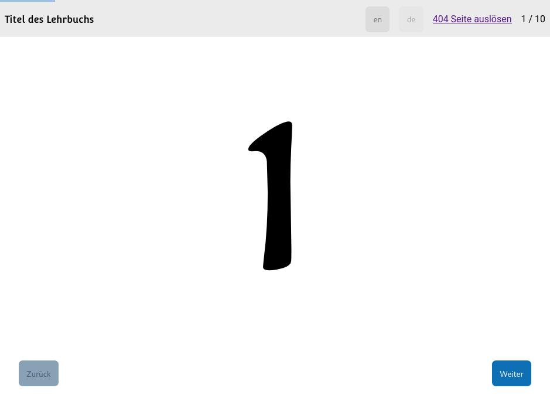

Lecture-Slides.js: Component Framework Benchmark
================================================

1. [Description](#description)
1. [Mockups](#mockups)
1. [Screenshots](#screenshots)
1. [Implementations](#implementations)
1. [Copyright](#copyright)

Description
-----------

This is a pre-study for the next version of [lecture-slides.js](https://github.com/DennisSchulmeister/lecture-slides.js).
The goal is to rewrite the frontend application with a more modern architecture
either using web components or one of the better known component frameworks like
Angular or React. For this the implications in terms of code complexity, bundle
size, maintainability etc. have to be understood. The research design is:

1. Identify suitable candidates of each category
2. Numerically rank the candidates within each category (see below)
3. Find the best candidate of each category according to the total score
4. Implement a medium-sized mockup with both chosen frameworks
5. Numerically evaluate the final results to find the ultimate winner (see more below)

Mockups
-------

The following images show a sketch of the demo application. Each implementation tries
to mimic this UI comparable features and code structure.

<table>
  <tr>
    <td>
      
    </td>
    <td>
      
    </td>
  </tr>
  <tr>
    <td>
      Mockup with English translation
    </td>
    <td>
      Mockup with German translation
    </td>
  </tr>
</table>

Screenshots
-----------

The following images show screenshots of the actual implementations.

<table>
  <tr>
    <td>
      
    </td>
    <td>
      
    </td>
  </tr>
  <tr>
    <td>
      The final application
    </td>
    <td>
      Error page of the final application
    </td>
  </tr>
</table>

Implementations
---------------

Prototypes have been developed with the following frameworks:

* [Tonic](tonic) (Web Component Framework)
* [Svelte 4](svelte) (Virtual DOM Framework)

Both prototypes make use of Typescript and esbuild. I used to use the Less CSS preprocessor
in the past. But since most of its features are contained in native CSS these days, it is
not used here. There are generic project templates for JavaScript and Typescript frontend
projects in the [_templates](_templates) directory.

Copyright
---------

This work is marked with CC0 1.0.
To view a copy of this license, visit https://creativecommons.org/publicdomain/zero/1.0/
